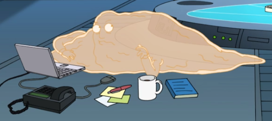
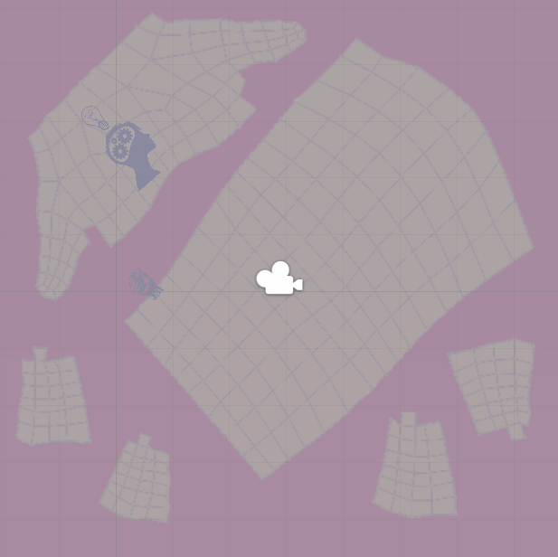

## Senior Production: Blog Ten – Dawn of the Final Day

When I think back to high school and the last few years at college, it always ceases to amaze me at how quickly time seems to pass. This last school year has absolutely flown by at the speed of light but it’s been one of the most intensive years I’ve ever had to struggle through and here we are at the end of my final semester at school and at the end of this amazing project I’ve ever had the opportunity to work on.

This was the final week of production on Elegy, and it’s bitter sweet. I’ll miss working on this game but I’m glad to have some time off from the production of this game now.

This week was mostly polishing and flushing out all of our game play from start to finish. I worked quite a few all nighters this week to help our team get everything accomplished. We missed sleep but our game is looking and playing incredibly. My main focus was to implement all of the audio that was provided to us from our Audio Designer and to fully flush out our vista scenes. I then moved onto the outside of the vistas aka the body game play as a tattoo and ran through the game fixing any bugs I possibly could to make our game have a lot of feedback for the player.

---

### Senior Production: Blog Nine – The End is Nigh

The end is finally in sight! But that also means the work load is going to be a nightmare now… Beta was due this week on Wednesday so we had to get as much in as possible as soon as we could. I received more audio from our Audio Designer and was able to pull a crazy long all night developer jam session on Tuesday night with the rest of the Engineering team.

Most of my focus that night was based on getting as much audio into the game as possible. I got a decent amount of it done but I also needed to help the team with development on the game play so I hopped over to help with that a ton.

I worked on flushing out and fully implementing the game play in the vistas. Overall it was a long night but we got a ton of development done and had full game play from start to finish even though it was a rough pass. Our next focus is to work on polishing and pulling together as much game feel as possible before the end of next week.

---

### Senior Production: Blog Eight – Can You Hear Me Now? Good.

After the complications with the Audio Manager last week, the good news is this week I was able to refactor it and have it working much better. I also created a basic FMOD project with a one-shot sound, and a sound that would loop. This way I was able to get sounds starting to play and work on more functionality for our Manager.

I changed up how I was adding events to the dictionary. I did this by making it so the events were created by just passing the string into a function in the manager and then adding the event to the dictionary. I was also starting to get some of our audio in via the FMOD projects banks which hold the audio connected to the events.

---

## Senior Production: Blog Seven – Sandals, Shorts, and Tank Tops

My initial implementation of the Audio Manager was done this week and last and finally it was time to test it out!

…bad news though, it didn’t go as smoothly as planned.

### ♫ The Good, The Bad, and The Audio Manager That Just Didn’t Want to Work… ♪
The first iteration of the Audio Manager was a rough one. I decided I’d handle the FMOD events aka the sounds via a Dictionary. Well with I had overseen an issue where I ended up mixing up the Key, which was our name of the event saved as a string with something called a state event. In the end I ended up scrapping this “state event” and just relying on a string for the name which is linked to the corresponding event saved in the Dictionary.

---

## Senior Production: Blog Six – Spring has Sprung & the Sap is Seeping!

This week was a busy week for me as far as other classes go. I had a ton to work on with Elegy as well of course! My initial rough implementation of the Audio Manager took place, and I met with our Audio Designer to discuss more functionality that they wanted to have to make it as easy as possible for us.

Other than both agreeing on having an Audio Manager to make it more simple for management of the Audio. We both wanted to have a way to keep track of all of the audio events. To handle this I’m considering to use a dictionary to keep track of all the events.

---

## Senior Production: Blog Five – Choo, Choo! Everyone Back on Board!

Ahh, The wonders of spring break! Everyone loves turning into a vegetable and becoming one with their couch watching tv and playing games. Well at least my roommate and I do, that’s for sure.

Basically this was us… Anyways… now that break is over and the teams back on track working it’s time to kick it into high gear and get as much done as possible since we only have 5 week remaining.

As mentioned briefly last week, I’ve taken over as the Audio Engineer for Elegy. So starting this week I setup a meeting with Jakey, our Sound Designer, and our Creative Director Jake. We were able to discuss where the Sound Design was currently at, what was desired in the sound department, and what our priorities were based on those desires.

### ♫ The Sound of Music ♪
While the sound was beginning to be developed, I started research into using FMOD and understanding how I could abstract it from our main code and basically just start and stop sound as needed. Looking into this lead me to my initial answer, building an Audio Manager. Since FMOD is designed similarly to that of an Event Manager and with my prior experience with them I was able to take that knowledge and apply it in this sense to get a decent grasp on how to handle this Audio Manager. I drew up a basic diagram of what I’d want for functionality in this Manager and started the implementation.

---

## Senior Production: Blog Four – Reorganizing the Blob

Oh, you’re still reading? It’s been a few weeks, but I appreciate you sticking around!

Over the last few weeks we had a slight delay in production due to the narrative of our game not being completed and needing to have it completed for the engineering team to continue to pump out content. We cleared this up this week when the design team created a document roughly outlining the entire narrative. Fear not though! the engineering team tried not to waste the time during this delay. John was continuing to work on the seam issue we were having while Jess and I refactored some of the game play code to make it more efficient.

### Lights, Camera, Action
Prior to the few weeks of narrative delay, we did have a huge amount of progression on the first vista!

The first vista we’ve nicknamed the car vista. It contains a variety of different items to represent a memory of the main character stealing her fathers car. The scene contains a radio, a cellphone, and a wallet. Once the narrative has been experienced in the scene by the player a feather is dropped to then be carried back to the main hub on the body.

For this scene I worked mainly on the radio. I worked on creating 2 knobs. One that would allow the player to change radio stations and the other to change the volume of the radio. There are also various buttons that will be pre-set to certain channels. We’re using the radio to create a fuller experience for the player by relaying the narrative via sound.

### Wait, What? I Couldn’t Hear You
After I had worked on the creation of the radio, between Jess and I we decided it would be helpful for me to take over for the audio implementation on the programmer side. Following this decision there was a meeting between our Audio Producer, a designer, and myself to discuss everything related to the initial setup of the audio and what was needed for sounds/background music.

---

## Senior Production: Blog Three – Windows into Vistas

To start off the week, Jess and I had a conversation about our templates and how many we were looking at creating. Instead we changed up our ideas for how we were going to implement our templates and pulled back a lot of unneeded ones thus by using the first full template, the vista implementation, we were able to utilize it as one full cohesive example. Continuing on into the week continued to work on the triggerable/trigger/interactive system and the vista implementation as a flushed out template.

### …Wait… That Tattoo is on the Other Side of the Body
UV Space, it’s a wonderful thing. I won’t go into too much detail but I’ll touch base on it quickly since it’s important to understand for our project. UV mapping is the process of taking a 2D image and projecting it upon the surface of a 3D model. For our project we’re doing this same process by having a 2D texture laid out in space in unity and we’re able to put tattoos on it and by having separate UV maps for each part of the body, for example, each arm, leg, the torso, and head. So UV space is the space within this 2D texture that will be wrapped around each body part.

Now that we have a rough understanding of UV space, we ran into a problem in creating our triggerable/trigger/interactive. We needed to be able to tell if our player was within range of a tattoo be enable any of the triggerable/trigger/interactives. When we check the distance it wasn’t able to check correctly via the model since all of our gameplay is technically happening in 2D space. So we had to rig up a function that would give us world space tattoo to tattoo. Below is an example of one of the UV maps.

---

## Senior Production: Blog Two – Bringing Tattoos to Life

- trigger/triggerable/interactive system using interfaces (had issue with checking location on tattoos in 2D space, had to find a way to do it via 3D and accounting for Z so converting tattoo space to world space)
- Meeting/discussion of what’s next
- Meeting regarding initial design implementation for vistas

I met with the rest of the engineering team and we discussed what our priorities were for the game and this coming week or so. Jess and I worked together to create a trigger/triggerable/interactive system that can be attached to any tattoo to give it either a trigger/triggerable/interactive state. This will help speed up production of the different tattoos by not having to rewrite the same code across multiple tattoos it also. We also have the ability to add specific code to any of the tattoos during their updates if required.

Following that we discussed that the vista system would be the next thing we worked on. Met with Jess and discussed how we we’re going to go about prototyping the system. Starting implementation tomorrow!

---

## Senior Production: Blog One – The Start of Something New

Once upon a time, there was a programmer. Well okay there are plenty of programmers out there but this story starts with me. So Hello! I’m Ben Campbell, If you haven’t read my previous blogs then welcome! I hope it’s enjoyable.

What is this? It’s pretty much a continuation of my previous blog aka part 2. I started the original blog as part of my capstone project and decided I would split off the second semester part of this due to the fact that I changed teams and it’s a brand new project to me so it deserves it’s own place.

So what is this new project you ask? Well, the name of my new teams game is Elegy Inc. “It’s a 3D puzzle adventure game where players help and interact with other tattoos on a deceased body to progress on their journey of understanding that human body’s past. The player explores several whole human bodies while completing logic and context puzzles to unfold the narrative surrounding the person they’re traveling on.” (TheLavaLantern.com)

I’ve fallen in love with the idea behind this project due to my love for art and body modification. I’m super excited to have been chosen to work with this new team.