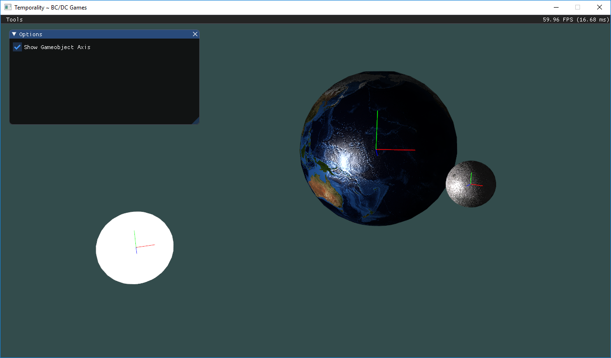

---
# Feel free to add content and custom Front Matter to this file.
# To modify the layout, see https://jekyllrb.com/docs/themes/#overriding-theme-defaults

layout: default
---

# Benjamin Campbell

Hello!

I'm Benji & Welcome to my portfolio! I originally started as a kid who loved to play video games but I had this want to understand how they were created so I started by creating custom maps in Warcraft 3. This eventually took me to where I am today where I'm currently attending Champlain College majoring in Game Programming.

I tend to enjoy Graphics Programming and Game Architecture. I've had the opportunity to take multiple classes on each of these topics and have fallen in love with them. I am now continuing to learn more and more about them each day.

Other technical skills: C++, C#, OpenGL/GLSL, Git, CMake, Unity3D, Unreal Engine 4 and Visual Studios.

# Projects

## Temporality
[More Info](https://github.com/benjinx/Temporality)

Everyone who enjoys engine programming should try their hand at creating a game engine from scratch and using it to create a game. This is the beginning of mine, Temporality. A C++ Game Engine, using OpenGL/GLSL designed to easily create AI, Gameplay, Graphics, Physics, and Networking demos.

---

## Elegy, Inc.
[More Info](/elegy.html)

If every tattoo tells a story, then the body is a chronicle of an entire life. In Elegy, Inc. you play as a tattoo and the body is the environment in which you must explore and puzzle-solve.